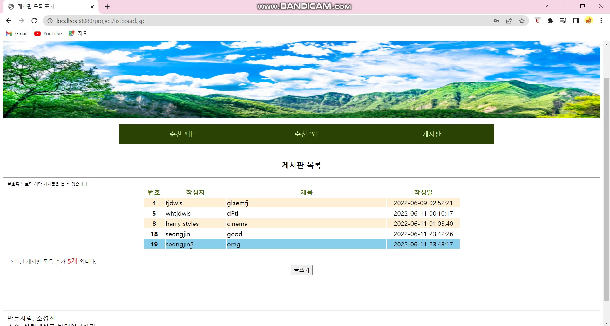
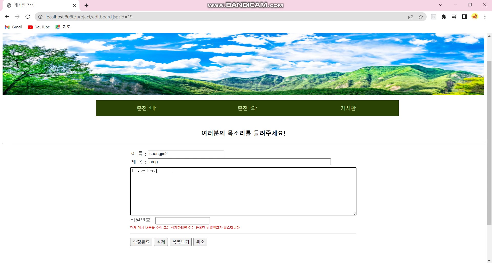

# Now Listen to Chuncheon!
'웹서버구축' 과목 프로젝트 (jsp, js, DB)

### Introduce
* 주제: 춘천을 소개합니다!
* '음악'과 관련 있는 축제 소개 및 게시판 구현

### skills
* 웹: JSP, JS
* 게시판: DB (mySQL)

### User Interface
* Just 'Click'
  
### Improvement points
* DB 연동 구현 추가 
* 반응형 웹으로 구현
* 춘천에서 지역을 넓혀 데이터 확대

### Images

